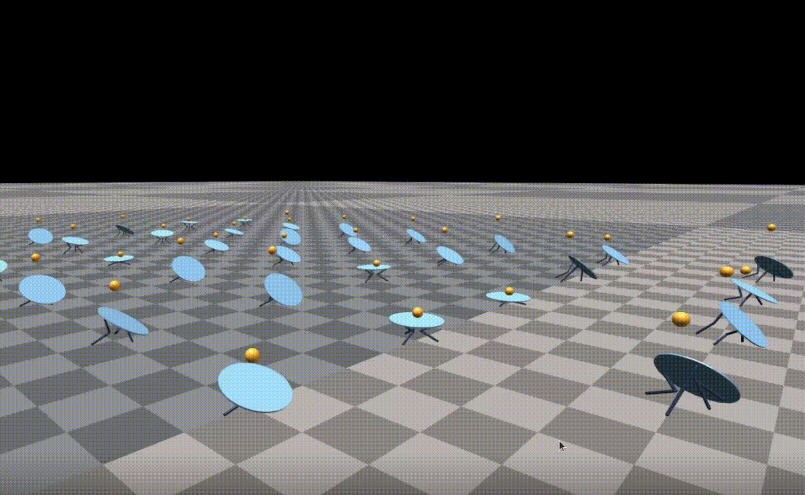
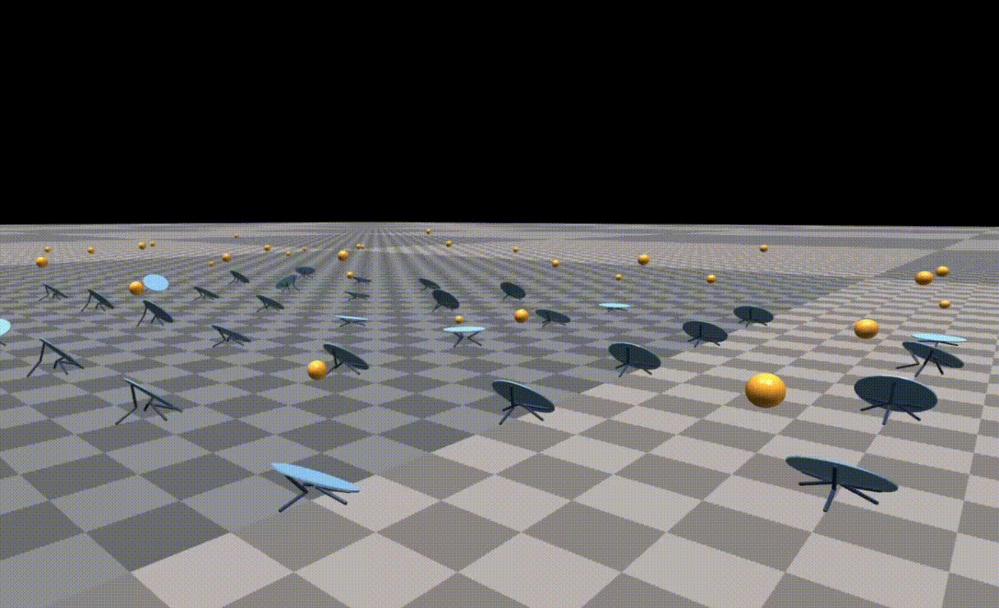
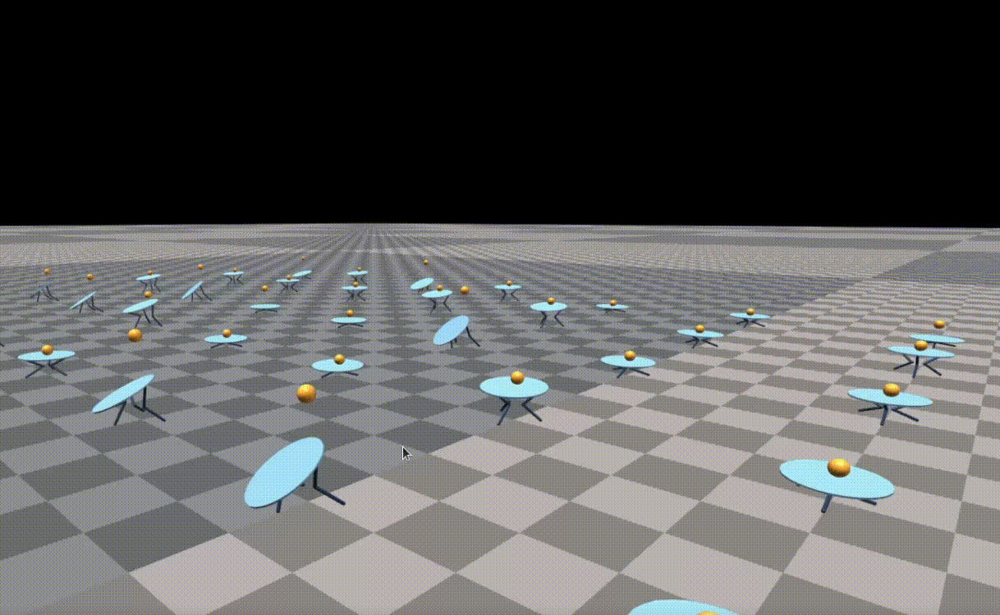
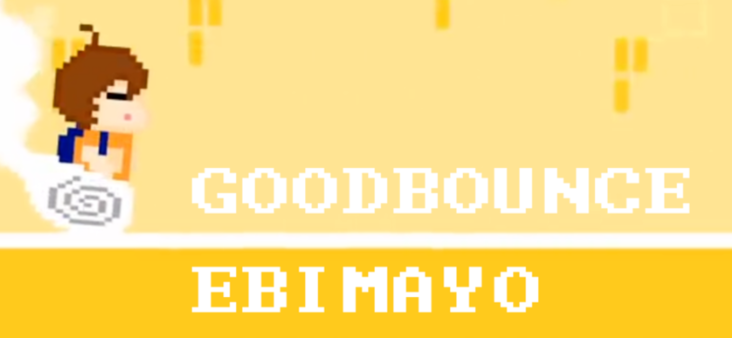

# GOODBOUNCE

[Bouncing in Isaac Gym](big) | [PIG (PPO for Isaac Gym)](pig) | Mini Paper | Poster

🏀 Balancing is Boring, Let’s Try Bouncing! CS3316 Reinforcement Learning Course Project.


## File Structure

- `big/` contains the Ball Bouncing task settings in Isaac Gym
- `pig/` implements the lightweight library PIG.
- `checkpoints/` includes some useful checkpoints by me. (It's not large, so I directly put them in the repo).


## Environment Settings

Please install [NVIDIA Isaac Gym Preview Release 4](https://developer.nvidia.com/isaac-gym) and [Isaac Gym Benchmark Environments](https://github.com/NVIDIA-Omniverse/IsaacGymEnvs) by following their instructions.


## Run Test

Run test using provided checkpoints. Valid task names are: `BallBounce`, `BallBalance` and `Cartpole`.


**Using RL Games checkpoints.**

```
python run_rl_games.py test=True checkpoint=checkpoints/rl_games/{checkpoint_name}.pth task={task_name}
```


**Using PIG checkpoints.**

```
python run_pig.py test=True checkpoint=checkpoints/pig/{checkpoint_folder} task={task_name}
```

The `checkpoint_folder` should contain both `actor.pth` and `critic.pth`.


## Run Training

**Note: RL Games and PIG use different configs. Modify the config files in** `big/env/cfg/train/` **according to your needs!**

We provide some template config files (With hyper parameters tuned in RTX 3080). Copy it to `{task_name}PPO.yaml` according to your needs.


**Using RL Games for training.**

```
python run_rl_games.py task={task_name}
```


**Using PIG for training.**

```
python run_pig.py task={task_name}
```


You can add configuration and command line arguments illustrated in [IsaacGymEnvs](https://github.com/NVIDIA-Omniverse/IsaacGymEnvs). Some useful command line arguments:

- `headless=True`  Don't render. Very useful in training.
- `num_envs=64` Sometimes too many environments will make CUDA OOM.
- `max_iterations=100` Configuring the max epoch num.


## Visualize Height Control

As described in Paper, we find some ways to control the height of bouncing.

#### Set different $h_{\text{target}}$ 

Left to Right: $h_{\text{target}} = 0.4, 0.7, 1.5$.  With $\alpha=2, \beta=1$. Without height limit.

<div style="display: flex;">
  
  
  
</div>


#### Height Limit

Height Limited: 1.5. With $\alpha=1, \beta=4, h_{\text{target}} = 0.7$.




## Misc

 

The name "GOODBOUNCE" not only means our Ball Bouncing task is interesting and "good", but also is the name of a song which ranks 4th in BOFU2016 by EBIMAYO. [BGA: Youtube](https://www.youtube.com/watch?v=XhzvgF-y6MA)